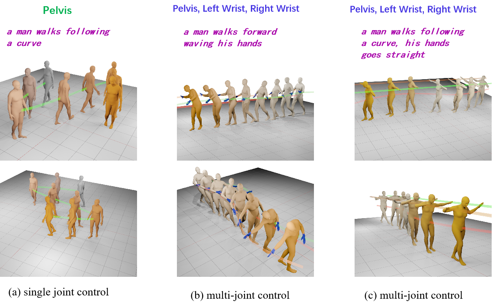

# ADControl: Towards Diverse and Controllable 3D Human Motion Generation
 
The official PyTorch implementation of the paper [**"ADControl: Towards Diverse and Controllable 3D Human Motion Generation"**](https://arxiv.org/abs/2209.14916).




## Train

```shell
OMP_NUM_THREADS=8 python train_trans_ED.py --exp_name 0518_omni67_multi_partxyz --batch_size 128 --gpu 3 --overwrite --print_iter 20 --save_iter 10000 --total_iter 200000 --lr 2e-4 --lr-scheduler 30000 --modeltype omni67 --loss_xyz 1 --xyz_type part --normalize_traj --multi_joint_control --root_dist_loss
```

## Generate motion from HumanML3D test split

```shell
python sample.py
```

## Evaluation generated motion metrics

```shell
python ADControl.py
```

## Evaluation trajectory control metrics

```shell
python eval_control.py
```